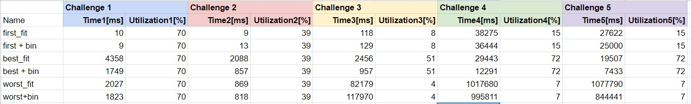
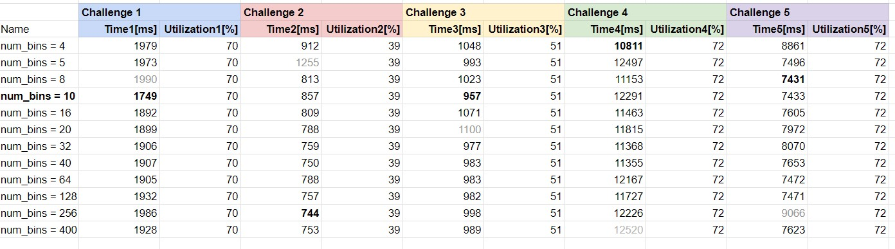

# HW7 (6/23~)

## 宿題の概要

1. Cポインタ百ます計算を解く
2. mallocの性能改善
    1. best-fit malloc, worst-fit mallocを実装して性能を比較する
    2. free-list binを実装する

## Cポインタ百ます計算

結果→ [画像](calc_pointer_100_Riho_Shimaoka.jpg)

気づいた点

- 例えばa[2]は aのアドレス+2  (=*(a+2)) の位置を指しているという風に言い換えられるので、それを応用してr[ _ ] や r[3+_ ]を解いた。

## mallocの性能改善 : [malloc.c](./malloc_challenge-main/malloc/malloc.c)

### 性能比較

*num_bins = 10
<br>
<br>

#### binの数を変えたときのtime比較

*bold = best time, gray = worst time 

### 考察

- utilization は　worst_fit ≤ first_fit ≤ best_fit という結果だった。(主にchallenge3~5)
    - worst_fitのuitilizationが悪かったが、これは大きいサイズが必要になったときに worst_fitでは free listからfitするものを見つけづらく、mmap_from_system()を使って新しくメモリを追加することが多くなるからだと考えられる。
    - best_fitでは空き領域の中でも小さいサイズのものから使っていくため、効率的にメモリを使うことができる。
- timeは bin使用時にそうでないときに比べてtimeが約2倍速くなった。(best_fit)
    - first_fitやworst_fitではbin使用時のtimeの改善にばらつきがあったが、これはfirst_fitやworst_fitではbest_fitに比べて空き領域不足の発生が起こりやすいので、メモリ追加時の処理でtimeが伸びているのかもしれない…?
- free list binはbinの数が10の時にbest timeのchallngeの数が一番多く、かつworst timeがなかったため10を選んだ。(best_fitで比較)


### best_fit

```python
// Best-fit: Find the smallest free slot the object fits.
  my_metadata_t *best_fit_metadata = NULL;
  my_metadata_t *best_fit_prev = NULL;
  while(metadata){
    if(metadata->size >= size){
        if(best_fit_metadata == NULL || **best_fit_metadata->size > metadata->size**){
            // Update the best fit
            best_fit_metadata = metadata;
            best_fit_prev = prev;
        }
      }
    prev = metadata;
    metadata = metadata->next;
  }
  // now, metadata points to the best free slot
  // and prev is the previous entry.
  metadata = best_fit_metadata;
  prev = best_fit_prev;
```


### worst_fit

```python
// Worst-fit: Find the largest free slot the object fits.
  my_metadata_t *worst_fit_metadata = NULL;
  my_metadata_t *worst_fit_prev = NULL;
  while (metadata) {
    if (metadata->size >= size) {
      if (worst_fit_metadata == NULL || **worst_fit_metadata->size < metadata->size**) {
        // Update the worst fit
        worst_fit_metadata = metadata;
        worst_fit_prev = prev;
      }
    }
    prev = metadata;
    metadata = metadata->next;
  }
  // now, metadata points to the worst free slot
  // and prev is the previous entry.
  metadata = worst_fit_metadata;
  prev = worst_fit_prev;
```


### free list bin

1. binの数と、binごとのサイズを決める
    <br>
    "|size| is guaranteed to be a multiple of 8 bytes and meets 8 <= |size| <= 4000."とあったので、4000 / binの数 でbinごとのサイズを決めた。
    
    ```python
    #define NUM_BINS 10
    #define SIZE_EACH_BIN 4000 / NUM_BINS
    ```
    
2. my_heapを my_heap[NUM_BINS]とする
3. 初期化をmy_heap一つ一つの要素に対して行う
    
    ```python
    void my_initialize() {
    
      for (int i = 0; i < NUM_BINS; i++) {
        my_heap[i].free_head = &my_heap[i].dummy;
        my_heap[i].dummy.size = 0;
        my_heap[i].dummy.next = NULL;
      }
    }
    ```
    
4. sizeからmy_heapのどのbinに入れるべきか計算し、my_heap.free_headをmy_heap[bin_index].free_headに書き換える
    
    ```python
    int bin_index = metadata->size / SIZE_EACH_BIN;
    metadata->next = my_heap[bin_index].free_head;
    ```